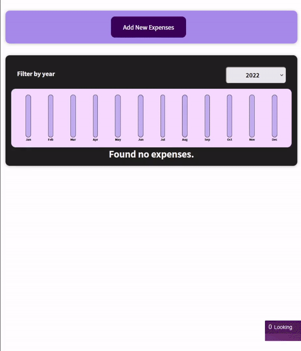

# Expense Tracker React App

## Overview

This app allows users to add new monthly expense and filter them by year. A nice chart UI which plots the sum of expenses updates dynamicaly.
Built while learning the course.

## [Expense Tracker App]()
